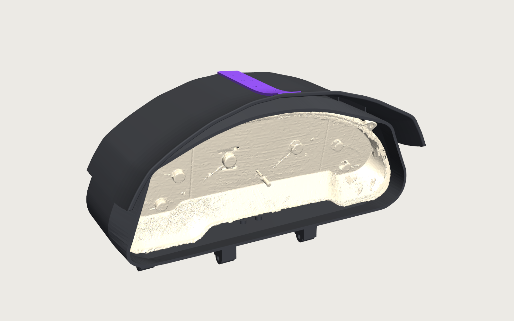
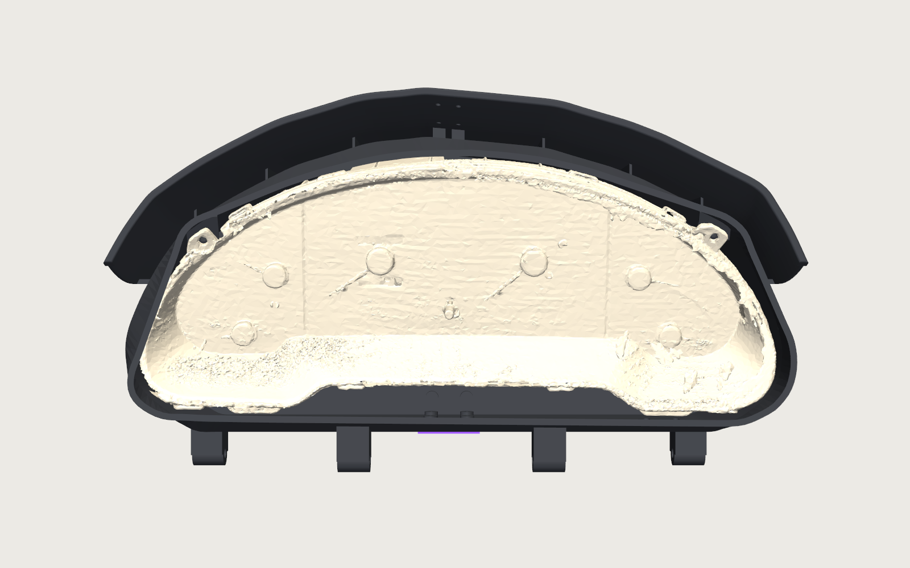
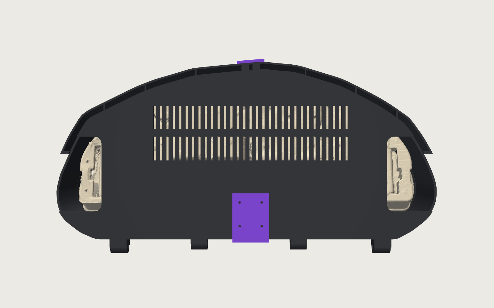
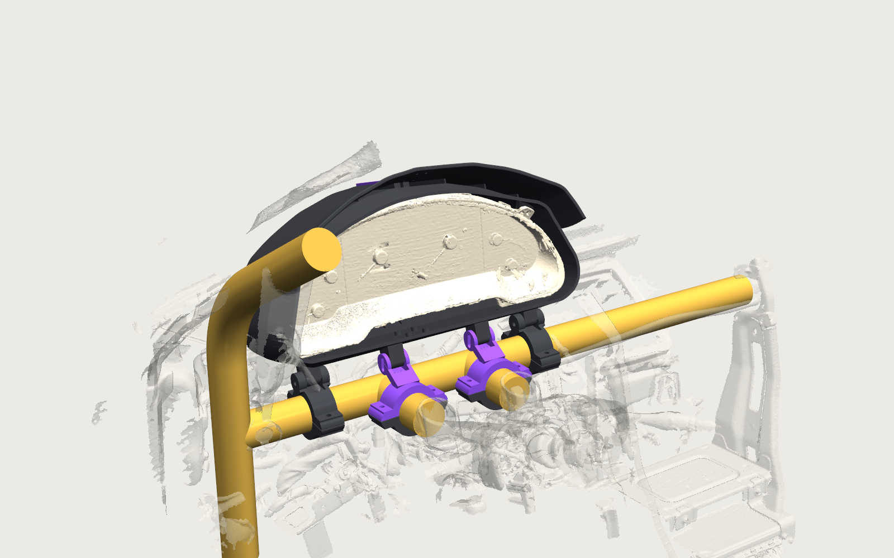
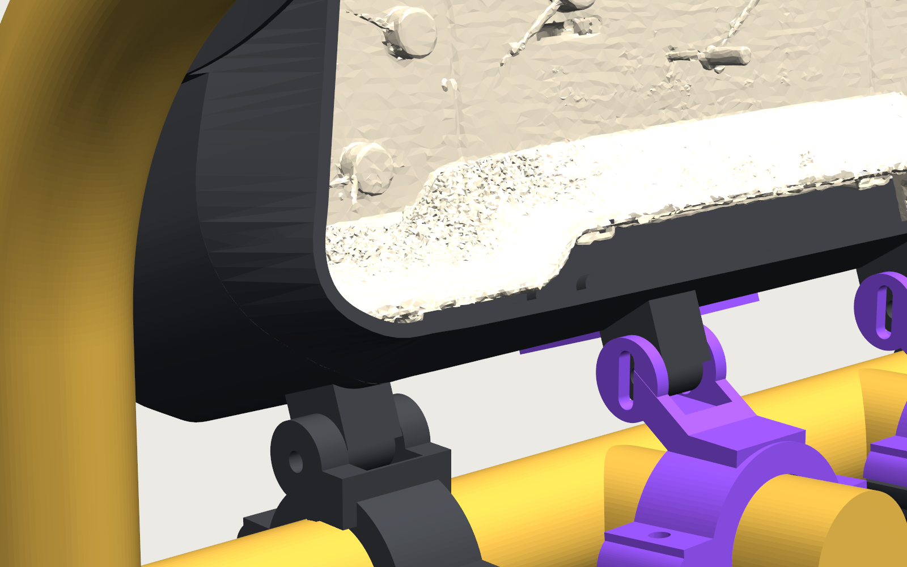

# Probe GT gauge cluster enclosure

A 3D-printed housing and roll-cage mount for the stock 1993 Ford Probe GT gauge cluster in our 24 Hours of Lemons car.
The dash is gone; the cluster lives in a two-piece charcoal ASA shell with a sun brow, bolted through its own OEM
mounting holes to two small printed feet and two bosses in the roof, and the shell hangs off the dash crossbar and the
two steering-support tubes on four split clamps. Designed from a 3D scan of the cluster and of the cage.

| | | |
|---|---|---|
|  |  |  |
|  |  |  |

## Print

All files in [`stl/`](stl/) are already oriented for the bed (Bambu P1S, 256 mm). ASA, 0.2 mm layers, 4 walls. The shells
take about 11 hours each; every other part is under 1.5 hours.

| Part | File | Qty | Colour | g | Infill | Supports |
|---|---|---|---|---|---|---|
| Shell L | [shell_L.stl](stl/shell_L.stl) | 1 | charcoal | 396 | 30 % gyroid | tree, only under the two knuckles; brim |
| Shell R | [shell_R.stl](stl/shell_R.stl) | 1 | charcoal | 379 | 30 % gyroid | same |
| Spine bar | [spine_bar.stl](stl/spine_bar.stl) | 1 | purple | 18 | 100 % | small support under the brow tip |
| Keel bar | [keel_bar.stl](stl/keel_bar.stl) | 1 | purple | 16 | 100 % | none |
| Foot L, Foot R | [foot_L.stl](stl/foot_L.stl), [foot_R.stl](stl/foot_R.stl) | 1 each | charcoal | 11 | 60 % | none |
| Bar clamp upper, driver and center | [driver](stl/bar_clamp_upper_driver.stl), [center](stl/bar_clamp_upper_center.stl) | 1 each | charcoal | 41 | 60 % | none |
| Bar clamp lower, driver and center | [driver](stl/bar_clamp_lower_driver.stl), [center](stl/bar_clamp_lower_center.stl) | 1 each | charcoal | 34 | 60 % | none |
| Arm clamp upper, driver and center | [driver](stl/arm_clamp_upper_driver.stl), [center](stl/arm_clamp_upper_center.stl) | 1 each | purple | 44 | 60 % | small support under the strut |
| Arm clamp lower, driver and center | [driver](stl/arm_clamp_lower_driver.stl), [center](stl/arm_clamp_lower_center.stl) | 1 each | charcoal | 34 | 60 % | none |

About 1.2 kg total. Looking at the gauges, L parts go on the right-hand side (the lug plate with round holes) and R
parts on the left (the plate with the slotted hole); every bracket is marked with 1 dot for L, 2 for R. `stl/test/` holds
optional fit aids: ear-boss coupons and ±3° foot variants.

Polymaker ASA on the P1S: nozzle 255 (260 first layer), bed 100 then 95, part fan 15 %, aux fan off, door closed, chamber
preheated, dry the spool first.

## Hardware

Nuts are plain M4 (7.0 AF, 3.2 thick) unless marked nyloc. No heat-set inserts.

| Item | Qty | Where |
|---|---|---|
| M4 x 16 + nut + washer (9 mm OD max) | 4 | lug plates to the feet |
| M4 x 20 + nut + washer | 2 | ear tabs to the roof bosses, from the front through the notch in the lens |
| M4 x 10 + nut | 4 | shell to feet, from below |
| M2.5 x 8 | 18 | spine bar (6) and keel bar (8) self-tapped into printed pilots, brow (4) with M2.5 nuts and washers |
| M6 x 55 + nyloc + 2 washers | 4 | pivot and lock pins through the clamp clevises |
| M6 x 40 + nyloc + washer | 8 | the four split clamps |

Shopping list: 10 M4 nuts, 6 M4 washers, 4 M2.5 nuts and washers, 12 M6 nylocs, 16 M6 washers, plus the bolts above.

## Assembly

1. Press M4 nuts into the hex pockets on the back of each foot slab and into the rear slots of each foot pad.
2. Cluster face down. Foot L behind the face-right lug plate, Foot R behind the face-left plate. Four M4 x 16 from the front.
3. Shell L on its outer side. Drop an M4 nut into the ear-boss channel (it opens upward in this position). Lower the
   cluster with its feet in from the split plane: pads on the bottom wall over the slots, ear tab against the boss.
4. Nut into Shell R's boss channel, then close Shell R over the cluster.
5. Two M4 x 20 from the front through the lens notches into the ear bosses. Four M4 x 10 from below into the feet; slide
   the cluster on the slots until the lens sits about 3 mm behind the nose rim, then tighten.
6. Spine bar: six M2.5 into the roof pilots, four through the brow with nuts. Keel bar: eight M2.5. Hand driver, stop at seat.
7. Ribbon cables in through the rear-corner ports, thumb locks outboard.
8. In the car: bar clamps loose at 107 and 417 mm from the driver-upright weld, clevises up; arm clamps loose about 55 mm
   forward along each steering-support tube, struts up and leaning back.
9. Drop the pivot knuckles into the bar-clamp clevises and the lock knuckles into the arm-clamp slots; four M6 x 55,
   heads outboard. Sit in the seat, set the pitch, tighten pivots, locks, arm clamps, bar clamps. On the bar clamps put
   the bolt heads underneath and the nylocs on top: the cowl-side nuts sit 33 mm under the shell, enough for an open-end
   wrench but not a ratchet.

To remove the cluster: four M6, lift off, two M4 from the front, four M4 from below, bars off, halves apart.

## Design

- The cluster is held only through its OEM holes: four M4 into nuts captured in the feet, two M4 into nuts in bosses
  moulded into the roof. Nothing is glued or drilled.
- The shell's front is a nose lofted to the scanned outline of the bezel rim with 2.5 mm clearance; the roof is a double
  skin over a ventilated air gap that continues as a 70 mm brow. The back is closed with two rows of vents and a port at
  each corner for the ribbon plugs.
- Four identical M6 knuckles on the bottom wall: two pivots directly above the crossbar, two pitch locks 33 mm forward
  above the steering-support tubes, locked on slots.
- Every fastener is driven from outside or on the bench. The generator checks driver reach for all 52 fasteners and
  samples every part against every other part and the cage; the current state is in
  [renders/inspection_sheet.png](renders/inspection_sheet.png).

CAD: Onshape document [937c54b34f0ccb974f37f949](https://cad.onshape.com/documents/937c54b34f0ccb974f37f949) (assembly ids
in `cad/output/onshape_ids.json`). Engineering details: [docs/engineering-notes.md](docs/engineering-notes.md).

## Regenerate

Everything is generated from constants in `cad/generate.py` (shell, feet; scan frame) and `cad/mount.py` (placement,
clamps; car frame). `cad/build.sh` runs the pipeline: geometry, placement, fastener and interference checks, bed-oriented
STLs into `stl/`, renders into `renders/`. `cad/push.py` uploads the FeatureScript to Onshape and rebuilds both
assemblies (about 30 API requests). Environment, once:

```bash
uv venv cad/.venv && uv pip install --python cad/.venv/bin/python cadquery trimesh shapely scipy ezdxf pyvista requests rtree networkx
```

```
cad/         generator, checks, print prep, renders, Onshape push; cad/output holds the generated FeatureScript
stl/         printable files (bed-oriented); stl/test for fit aids
renders/
reference/   cluster_scan (mesh, silhouettes, hole CSV) and cage_scan (fitted tubes, surroundings)
docs/        engineering notes
```
