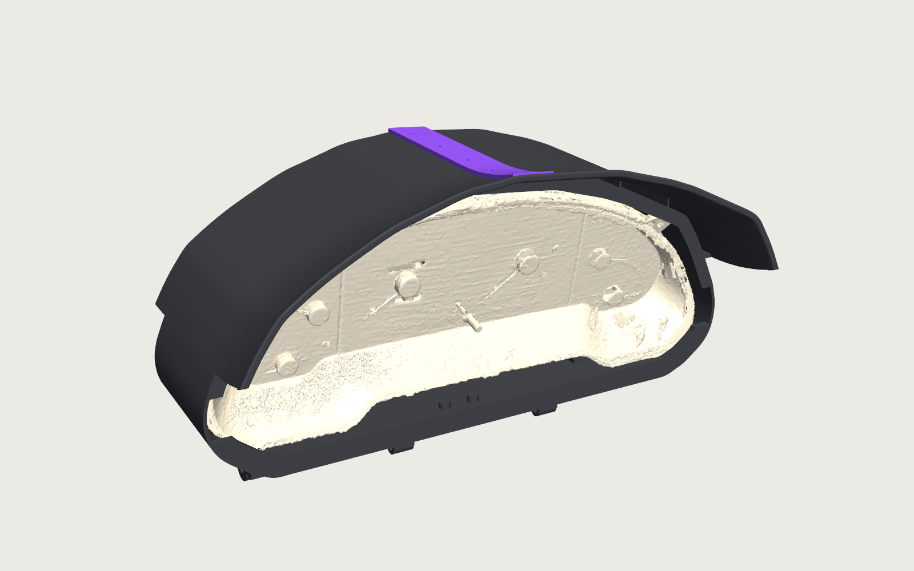
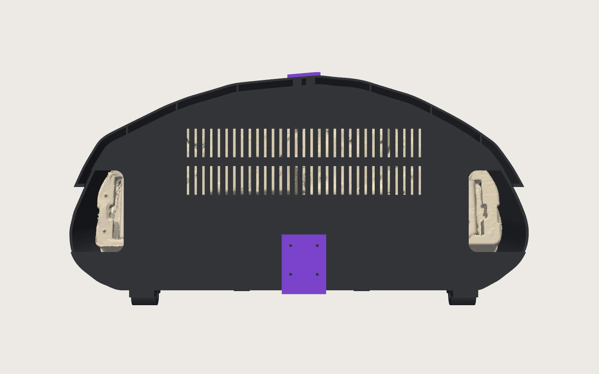
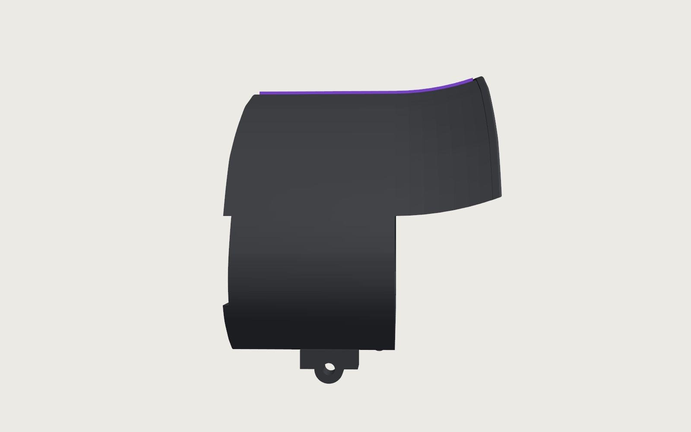
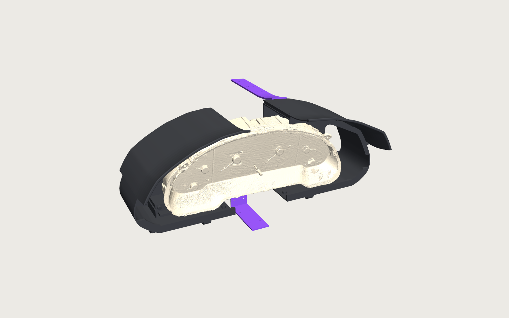

# 1993 Ford Probe GT gauge cluster enclosure



Roll-cage-mounted enclosure and sun brow for the OEM Probe GT gauge cluster, designed from a 3D scan of the cluster.
Aesthetic brief: the same "Teenage Engineering designs for a race car" language as the 4OGS race logger (charcoal body,
one purple accent, exposed aligned fasteners), mounted Ducati-Monster style off the exposed cage over time.

Build guide (parts, hardware, print and assembly): [docs/BUILD.md](docs/BUILD.md).

## Layout

```
onshape_reference_package/   scan deliverables (STL, colour PLY, DXF silhouettes, hole CSV, README_Onshape.md)
mechanical/generate.py       single source of truth: constants -> CadQuery (local STLs + mesh clearance check) and FeatureScript
mechanical/render.py         pyvista renders of the STLs with the scan mesh inside -> mechanical/output/renders
mechanical/push.py           uploads the FeatureScript to the Onshape Feature Studio and (re)inserts the custom feature (spends API allocation)
mechanical/output/           generated: *.stl, probe_cluster_enclosure.fs, seat_data.json, onshape_ids.json, renders/
```

Run (scratch env with cadquery, trimesh, shapely, scipy, ezdxf, pyvista, requests):

```bash
python mechanical/generate.py        # geometry + clearance report (~20 s)
python mechanical/render.py          # renders
source ~/.zshrc && python mechanical/push.py   # ~7 Onshape API requests
```

## Coordinate frame

Scan frame, millimetres: **X** across the cluster, **Y increases downward in the car**, **Z toward the driver**
(bezel front at about +50, harness connectors at the rear down to -56). Everything (STL, DXF, hole CSV, FeatureScript)
shares this frame so it lines up in Onshape without transforms.

## Design (enclosure v0.4 + mount v0.1, 2026-09-26)

- **Shell L / Shell R**, split at X = 0 (a 405 mm part does not fit the P1S bed). The halves close around the cluster;
  the cluster is never drilled or screwed. Cavity is the scan silhouette hull (corners rounded to R12) offset 4 mm.
- **Cradle retention**: ledges under the two bottom lug plates carry the weight; a fin outside each plate fixes X and yaw;
  tilted stop pads behind lug holes B2 B3 B5 B6 and ears T1 T2 stop rearward motion; a top lip (4 mm over the rim) and a
  bottom chin (reaches the bezel's lower rim) stop forward motion. All pad heights come from the scan (1 mm standoff).
  Add thin foam tape on the lip rear faces if the cluster rattles.
- **Closed back with two ribbon ports** (v0.3): the rear wall (inner face z -58) covers the PCB and both centre connector
  housings. The ribbon cables plug into two vertical PCB slots (left x -179..-173, right x 161..168, y 2..50, thumb locks
  facing outboard); each rear corner has a port from 12 mm inboard of its slot out to the side wall, 12 mm above and below
  the slot, so a plug can be pushed in and its thumb lock worked from behind. Two rows of 2.4 mm vent slots (x +-105,
  y -48..-22 and -14..12) cool the PCB. Four M6 nut-pocket pads (x = +-60, y = 26 and 48) are the cage-bracket interface.
- **Double skin**: the sun-facing arch has a second 2 mm skin on a 6 mm ventilated air gap (ribs at x = +-60, +-115,
  +-160 and two 8 mm ribs at x = +-6 that carry the spine inserts). The skin continues forward as a 70 mm brow that follows a
  200 mm arc curling up toward the driver (lofted through 6 sections) and ends in a 5 mm rounded bead, so there is no
  sharp edge to bump against (Brian's suggestion).
- **Spine bar** (top ridge, purple) and **Keel bar** (rear + bottom seam, purple) join the halves: M2.5 x 8 socket screws
  into the user's M2.5 x 4 heat-set inserts (3.4 mm bores), two visor screws with nuts underneath.
- **Test coupon**: M2.5 insert bore, M2.5 self-tap pilot, M6 nut pocket + clearance, fin slot.

Print: halves rear-face down (the front lips are the only overhangs, small support strips), ASA, charcoal; bars purple.

## Cage mount (mechanical/mount.py, car frame)

Car frame from `dash_cage_reference` rev 2 (mm): X along the dash crossbar driver -> passenger, Y forward to the cowl, Z up,
origin at the crossbar centreline by the driver upright. Fitted tubes: crossbar, driver upright and the two 1.75 in
steering-support arms (x ~203 and ~325, running toward the driver). Scan -> car placement is `car = (X_C - x, -z, -y)`
then pitch about X, with the gauge face 16 mm behind the crossbar's driver-side surface (`FACE_Y` -38), the front-bottom
edge 50 mm above the bar top (`EDGE_LIFT`), the face leaning back 20 deg (`PITCH`), centred on the steering column
(`X_C` 262). `placement_checks.json` reports the sightline over the brow (eye and windshield base are guesses), gauge
visibility over the wheel rim and clearances.

Mount v0.3, four clamp points and no side-bar stay: two split **crossbar clamps** (x 107 and 417) whose upper halves carry
clevises for the enclosure's two M8 pivot knuckles, directly above the bar; two split **arm clamps** (55 mm along each arm)
whose upper halves carry short struts with slotted clevises for the enclosure's two M6 lock knuckles near the front-bottom
edge. Pitch is set on the slots (+-5 deg) then locked. Load path: cluster -> cradle -> shell -> 4 knuckles -> 4 clevises ->
4 clamps -> crossbar and both arms. Fitting steps in [docs/BUILD.md](docs/BUILD.md).

## Onshape

Document `probe-gt-gauge-cluster-enclosure`: did `937c54b34f0ccb974f37f949`, wid `275b479cd4996a16dce317f4`,
Part Studio 1 `c10029ec19783bb5bae02ce9`, Feature Studio "Cluster enclosure FeatureScript" `4b35d3a06a0b574150eddd3c`.
Custom feature "Probe cluster enclosure" with toggles for the four part groups. Mount Part Studio "Mount (car frame)"
`b65a54a9ba95bae5db018db8` holds custom feature "Cluster cage mount" (same Feature Studio). Assemblies (rebuilt by push.py
on every push, ids in onshape_ids.json): "Enclosure assembly" (dash + cluster scan, scan frame) and "Full system (car frame)"
(mount, cage tubes, dash scan, enclosure and cluster placed by T). Imported meshes: cluster scan `177864c843a60c8c5b179426`,
cage tubes rev 2 `e57c95bb4c9958368ddddebb`, dash surroundings `c059b218bc9efffc19272856`. push.py also rebuilds "Enclosure
assembly" (id in onshape_ids.json) after every successful push because regenerated parts get new IDs; the scan mesh
Part Studio `177864c843a60c8c5b179426` is inserted as PARTS and SURFACES. The feature carries step tracking: if an
op fails it creates a body named `FAILED step N: ...` instead of an opaque error (push.py prints part names).
FeatureScript notes learned on this project: intersections use SUBTRACT_COMPLEMENT (keeps the target's identity), the
visor is a two-profile loft (a sheared prism), halves come from opSplitPart, and bodies that must merge overlap by 0.3 mm
rather than sharing spline faces. Import
`onshape_reference_package/cluster_onshape_reference_mm.stl` (millimetres) by drag-and-drop for a visual overlay; that
costs no API allocation.

## Renders

| Rear (ribbon ports, vents) | Side (brow) | Exploded |
|---|---|---|
|  |  |  |

## Open items

- Confirm the sightline in the car: with the assumed eye (580 above / 800 behind the bar axis) and windshield base (210
  above, 280 forward) the brow sits 25 mm below the line, as requested (gauges 1-2 in over the bar).
- Only the crossbar, driver upright and the two steering-support arms are fitted tubes; the rest of the cage is scan mesh or absent.

- Roll-cage bracket (needs the cage model).
- Physical check of the lug plate ledge/fin fit and rim lip clearance with the coupon and a lug-corner test print.
- Visor length/droop and skin end position are constants in generate.py; tune after the first look in the car.
