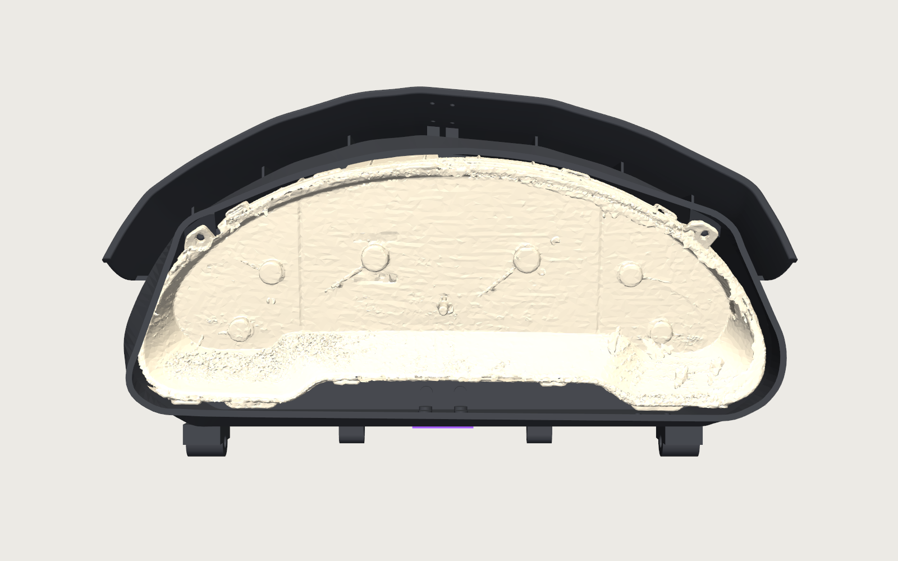
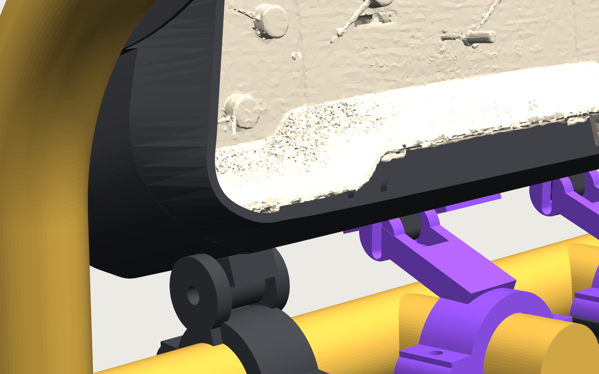
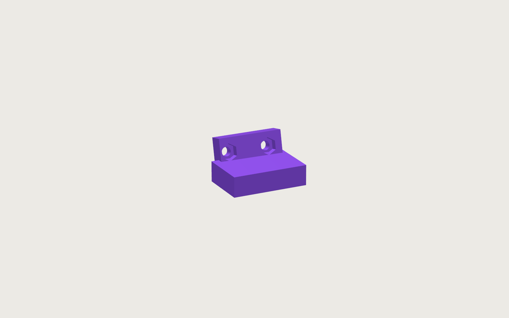

# Build guide: Probe GT gauge cluster enclosure and cage mount

**Status (2026-09-30, v0.6).** Two test prints and a bolt-up later, the design is:

- **Chassis: two printed lug feet** bolted to the cluster through its own OEM lug holes (four M4). Each foot captures two
  M4 nuts in rear-entry slots; four M4 come up from under the shell into them. Proven on the bench with the R side.
- **Ears: two bosses moulded into the shell roof.** Each ear tab bolts from the front, through the notch in the lens, into
  a standard M4 nut sitting in a side-entry channel in the boss. No inserts, no roof holes, nothing driven at an angle
  inside the shell. The boss is the exact solid of the separate ear block that fitted in the v0.5 test.
- **Body: the shell** is a cover with a **nose**: from 30 mm behind the face the wall lofts inward to the scanned outline of
  the bezel's front rim plus 2.5 mm, so the shell hugs the black frame instead of hovering 17 to 29 mm outside it
  (the v0.5 opening followed the widest outline at the back of the shroud). The brow springs from where the nose starts.
- **Mount (v0.3)**: four split clamps on the crossbar and the two steering-support arms, M8 pivots, M6 locks. The lock
  knuckles moved 22 mm rearward to stay on the straight part of the bottom wall; the mount STLs are regenerated.
- **Fastener access is checked by the generator** (`mechanical/fastener_check.py`): all 36 fasteners have their reach at
  the stage where they are driven. Section 7 says what that means in the car.
- **Hardware is all M4** except the M2.5 for the two purple bars and the cage-clamp bolts.

## 0. Print order and the two checks

| Step | Part | File | ASA | Time |
|---|---|---|---|---|
| 1 | Foot lug L, Foot lug R | `mechanical/output/print/print_foot_lug_L.stl`, `..._R.stl` | 11 g each | ~1 h each |
| 2 | Shell L | `print_shell_L.stl` | 392 g | ~11 h |
| 3 | Shell R | `print_shell_R.stl` | 375 g | ~11 h |
| 4 | Spine bar, Keel bar (purple) | `print_spine_bar.stl`, `print_keel_bar.stl` | 18 + 16 g | ~3 h |
| 5 | Bar clamp lower driver (tube fit), then plate D | `print_bar_clamp_lower_*.stl` etc. | 34 g / ~330 g | 1 h / ~8 h |

Feet: pad face on the bed (already oriented), no supports, 60 percent infill. If the pad rocked in your bench test, the
`print_foot_lug_*_tilt-3.stl` and `tilt+3.stl` variants rotate the slab 3 degrees about the bolt line either way.

Shells: rear wall on the bed, brow up, brim on, tree supports **only under the two knuckles**. The nose leans inward at
20 to 35 degrees and prints unsupported; the roof, sides, vents, ports and air gap need nothing. 0.2 mm, 4 walls,
30 percent gyroid.

**Check 0, ear-boss coupons (15 min each, before Shell L):** `print_ear_coupon_L.stl` and `_R.stl` are the ear boss with
the roof above it, cut straight out of each shell. Slide an M4 nut into the channel from the open (inboard) face: it should
push in with a fingertip, wedge snug at the end, and sit centred under the 5 mm hole. Then hold the coupon behind the ear tab
and run an M4 x 20 through the tab into the nut. Channel is 7.2 mm wide at the end tapering to 7.6 at the mouth, 3.4 thick,
end 4.15 mm past the bolt axis so the nut's corners clear. Knobs: `NUT_M4_SLOT_W`, `EAR_CHAN_MOUTH_W`, `NUT_M4_SLOT_T`.

**Check A, feet (before the shells, when the M4s arrive):** nuts into the rear slots of the slab, feet behind the lug
plates, four M4 x 16 with washers from the front. Stand the cluster on its feet on a flat table: both pads flat, no rock
over 0.5 mm, nothing but the plates touching the feet, ribbon plugs still fit.

**Check B, Shell L alone (before Shell R):** lay Shell L on its outer side, lower the cluster-with-feet in from the split
plane. The pad should land on the bottom wall with its two nut slots over the two slotted holes, the ear tab should sit
flat against the ear boss with its hole lined up (5 mm hole in the boss), the bezel rim should have about 2.5 to 3 mm of
daylight to the nose all round, the lens front should sit about 3 mm behind the nose rim. Drop an M4 nut into the boss
channel from above (it faces up with the half on its side) and run an M4 x 20 through the ear from the front.

## 1. Printed parts

### Chassis (scan frame STLs)

| Part | File | Qty | Colour | Notes |
|---|---|---|---|---|
| Foot lug L | `mechanical/output/foot_lug_l.stl` | 1 | charcoal ASA | behind the face-right lug plate (scan holes B2 B3); 37 x 31 x 21 mm |
| Foot lug R | `mechanical/output/foot_lug_r.stl` | 1 | charcoal ASA | behind the face-left lug plate (scan holes B5 B6) |
| Foot lug L / R tilt -3 / +3 | `mechanical/output/foot_lug_*_tilt*.stl` | as needed | any | angle variants for the bench check only |

Each foot is an L: a slab parallel to the lug plate (0.8 mm off its rear face, two 4.5 mm holes, hex nut pockets at the
back) and a pad reaching down to the shell's bottom wall. The pad has two rear-entry slots for M4 nuts (7.1 x 3.4) at mid
height and two vertical 4.5 mm holes in line with the M4 lug bolts above; the shell bolts come up from below into those nuts.

**ID marks** (debossed 0.8 mm): **1 dot = L, 2 dots = R** on the pad's rear face. Tilt variants carry a bar on the pad's
outboard end face: **"-" = tilt -3, "+" = tilt +3**, no bar = nominal. L is the **face-right** side (round-hole lug
plate, scan holes B2 B3 T1); R is the **face-left** side (slotted lug hole, scan holes B5 B6 T2).

### Body (scan frame STLs)

| Part | File | Qty | Colour | Notes |
|---|---|---|---|---|
| Shell L | `mechanical/output/shell_l.stl` | 1 | charcoal ASA | 213 x 229 x 164 mm; nose, ear boss, ribbon port, two slotted M4 holes in the bottom wall |
| Shell R | `mechanical/output/shell_r.stl` | 1 | charcoal ASA | not a mirror of L: the cluster is not symmetric |
| Spine bar | `mechanical/output/spine_bar.stl` | 1 | purple ASA | joins the halves along the roof ridge and brow |
| Keel bar | `mechanical/output/keel_bar.stl` | 1 | purple ASA | L-shaped, rear wall and the rear part of the bottom seam; stops at z 12 |
| Test coupon | `mechanical/output/test_coupon.stl` | 1 | any | optional |

Ear bosses: 20 x 18 x 10 mm blocks inside the roof behind each ear tab, 0.8 mm off the tab's rear face, 5 mm bolt hole,
nut channel 7.1 x 3.4 open toward the split plane with a 1 mm wall at the back. Their position comes from the scan hole
CSV, which the v0.5 ear block confirmed on the R side.

### Mount (car frame STLs, `mechanical/output/mount_*.stl`, v0.3)

| Part | Qty | Colour | Notes |
|---|---|---|---|
| Bar clamp lower driver / center | 2 | charcoal ASA | plain split-clamp halves for the 1.75 in crossbar |
| Bar clamp upper driver / center | 2 | charcoal ASA | upper halves with the pivot clevis (M8) growing out of the ring |
| Arm clamp lower driver / center | 2 | charcoal ASA | plain halves for the two 1.75 in steering-support arms |
| Arm clamp upper driver / center | 2 | purple ASA | upper halves with a short strut and slotted lock clevis (M6) |

"driver" = toward the A-pillar bar (car x 107 on the crossbar, the arm at x 203); "center" = toward the passenger
side (crossbar x 417, arm at x 325).

## 2. Hardware

Nuts are standard M4, 7.0 mm across flats, 3.2 thick. Washers 9 mm OD or smaller.

| Item | Qty | Used for |
|---|---|---|
| M4 x 16 button or socket head + nut + washer | 4 | cluster lug plates to the feet (plate 4.8 + gap 0.8 + slab 4.4 + nut 3.2 = 13.2) |
| M4 x 20 button or socket head + nut + washer | 2 | cluster ear tabs to the shell's ear bosses, from the front through the lens notch (tab 7 + gap 0.8 + boss 5.6 + nut 3.2 = 16.6) |
| M4 x 10 button head + nut | 4 | shell to feet, from below (wall 2.5 + gap 0.3 + pad 3.5 to the nut + nut 3.2 = 9.5; x 12 also fine) |
| M2.5 x 4 heat-set inserts, 3.5 mm OD | 14 | 6 under the spine bar, 8 under the keel bar (all straight, into flat faces) |
| M2.5 x 8 socket or button head | 18 | 6 spine bar, 8 keel bar, 4 through the brow with nuts |
| M2.5 nuts + small washers | 4 | the two screw pairs on the brow (2 mm skin, no rib for an insert) |
| M6 x 55 bolts, nyloc nuts, 2 washers each | 4 | the two pivot pins and the two pitch locks (v0.7, all four knuckles identical): two 10 mm clevis blades + 20 mm knuckle + 0.6 + washers 3 + 6 mm nyloc = 50 |
| M6 x 40 bolts + nyloc nuts + washers | 8 | the four split clamps (2 each): two 14 mm flanges + nut + washer = 35.5, so 40 leaves 4.5 mm proud; 35 is flush |

No M4 inserts anywhere. The only heat-set inserts are the 14 straight M2.5 for the bars.

## 3. Print

Material: ASA. 0.2 mm layers, 4 walls; 60 percent infill for feet and clamps, 30 percent gyroid for the shells,
100 percent for bars and coupon.

1. **Feet first** (section 0): pad face down, no supports.
2. **Shells**: rear face down, brow up, brim on, supports only under the two knuckles. About 11 hours each. Heat-set the
   spine and keel inserts afterwards: 6 from the roof skin at x +-6, z -40 / -8 / +22; 4 in the rear wall pads at x +-12,
   y 58 and 84; 4 in the bottom wall pads at x +-12, z -30 and 0.
3. **Spine bar**: inner (concave) face down, small support under the curled brow end. **Keel bar**: rear leg flat.
4. **Clamp-fit sample.** One *Bar clamp lower* half on the painted crossbar; the bore is 44.85 mm (`CLAMP_BORE` in
   `mechanical/mount.py`). Adjust and reprint before the other seven halves.
5. **Clamp halves**: split face down; clevis and strut grow upward with no supports.

## 4. How the mount connects to the enclosure

The shell's bottom wall carries four knuckles, all moulded into the shell halves:

All four knuckles are identical (v0.7): 20 mm wide, 24 mm deep, pin 16 mm below the wall, 6.4 mm bore, M6.

- **Two pivot knuckles** directly under the two feet, at scan x +-155, land directly above the crossbar. Each drops into
  the 12 mm clevis on a *Bar clamp upper*; the ring is notched under the knuckle so its round bottom clears. An M6 through
  clevis and knuckle is the pitch axis.
- **Two lock knuckles** at scan x +59 and -62.5, z 40 (33 mm forward of the pivots, under the nose), directly above the
  two steering-support arms. Each drops into the slotted 13 mm clevis on an *Arm clamp upper*; an M6 through the slot
  locks the pitch. The 12 mm slot gives about +-10 degrees of trim.

The generator now checks the clamp bodies against the shell and the shell against the cage tubes
(`fastener_check.py`, part interference table). The v0.6 clevises were 5 mm into the wall and this is what caught it.

Load path: cluster -> M4 lug bolts -> feet -> M4 bolts through the bottom wall -> knuckles (about 15 mm away) ->
clevises -> clamps -> crossbar and both arms. The ear bolts tie the top of the cluster to the roof so the lug plates
carry no pitching moment. Nothing hangs off the A-pillar bar and nothing is glued.

## 5. Assembly

Chassis, on the bench: two M4 nuts into the hex pockets on the back of each foot slab, two more into the rear slots of each
pad. Feet behind the lug plates (L behind the face-right plate), four M4 x 16 with washers from the front.

Body:

1. Lay Shell L on its outer side, split face up. Drop an M4 nut into the ear boss channel (it opens upward in this
   position) and push it home against the back wall of the channel.
2. Lower the cluster with its feet in from the split plane: the pad lands on the bottom wall over its two slotted holes,
   the ear tab lies against the boss.
3. Shell R over the cluster until the halves meet at the centre seam. Its boss passes behind the R ear tab. Nut into its
   channel before closing, from the inboard side.
4. Two M4 x 20 with washers from the **front**, through the notch in the lens and the ear hole, into the boss nuts.
5. Four M4 x 10 from **underneath**, through the slotted holes in the bottom wall into the pad nuts. Slide the cluster
   fore-aft on the slots until the lens sits about 3 mm behind the nose rim, then tighten.
6. Spine bar (six M2.5 into inserts, four brow screws with nuts), keel bar (eight M2.5).
7. Plug the two ribbon cables into the PCB slots through the rear-corner ports; thumb locks face outboard.

Mount:

8. Fit the two bar clamps loosely at 107 and 417 mm from the driver-upright junction along the crossbar, clevises up,
   M6 x 40 through the fore-and-aft flanges.
9. Fit the two arm clamps loosely on the steering-support arms, struts up and leaning back toward the crossbar.
10. Lower the closed enclosure so the two pivot knuckles drop into the bar-clamp clevises; M8 bolts with nylon washers,
    nyloc nuts loose. Swing the lock knuckles into the arm-clamp clevises, M6 bolts through the slots, heads outboard.
11. Sit in the car. Slide the clamps along their tubes until the knuckles sit centred in the clevises, set the pitch so the
    gauge face looks straight at you, then tighten: M8 pivots, M6 locks, arm clamps, bar clamps.
12. Check the ribbon plugs can still be pulled and reseated with everything tight.

To take the cluster out later: two M8, two M6, lift the enclosure off. Then two M4 from the front (ears), four M4 from
below (feet), keel bar, spine bar, halves apart. The cluster comes out with its feet still on.

## 6. What the test prints measured (2026-09-27 to 09-30)

These numbers drive the geometry; they are also constants in `mechanical/generate.py`.

- OEM mounting holes: all eight are 5.3 mm; B6 (face-left lower outer) is a 5.3 x 8.8 slot. The scan had 5.3 to 6.8.
- Lug hole pair spacing 19.7 mm (scan 20.2). Lug plates 4.8 mm thick, ear tabs 7.0 mm, 19.5 wide, standing 10 mm above the
  housing top with the hole about 5 mm below the tip. The lens is notched around each tab. Free space behind the lug
  plates 38 mm, behind the ears 50 mm.
- The CSV hole centres lie on the tabs' **rear** faces (the holes were fitted on the rear scan).
- The cluster is 2 to 3 mm deeper than the scan (it touched a wall designed 2.2 mm clear); the rear wall moved back 3 mm.
- The clear lens stands about 11 mm proud of the scanned rim (the scanner did not see it) and about 5 mm proud of the
  black frame's front edge at its widest.
- The bezel shroud tapers: scanned outline y -81.6 at the back, -70 at the front rim, sides in by 5 to 30 mm depending on
  height. The v0.5 opening followed the back and left 17 to 29 mm of air; the v0.6 nose follows the rim.
- Ribbon plugs: face-right 51 x 9.6 mm, face-left 59.8 x 9.6 mm, thumb lock adds 4 mm outboard.
- Each lug plate has a rib along its outer edge 6 to 7 mm outboard of the outer hole, hence the feet's short outboard margin.
- Heat-set inserts at odd angles are unreliable in FDM (they melt in and wander); the v0.6 design uses none.

## 7. Fastener access (what the check says about working on the car)

`python mechanical/fastener_check.py` sweeps an 8 mm driver from every head along its axis, against the parts present at
the stage where that fastener is driven, and also reports the free length with everything fitted. All 36 fasteners have
their reach (60 mm for a screwdriver, 30 mm for a socket).

- The two ear M4s are reachable **with the shell closed and the enclosure on the cage**: 150 mm free through the lens notch.
- The four feet M4s from below have 31 mm in the car where the bar clamps sit under two of them, so they are done with the
  enclosure off the cage (or with a stubby driver).
- Keel rear screws face the dash, 25 to 43 mm away; keel bottom screws have 34 mm to the crossbar. Fitted on the bench.
- M8 pivots: on the driver-side clamp put the **nut on the outboard side** (49 mm to the dash). M6 locks: **heads
  outboard, nuts inboard**.

## 8. Regenerating

Everything is generated from constants: `mechanical/generate.py` (feet, shell, scan frame) and `mechanical/mount.py`
(placement and mount, car frame). `python mechanical/generate.py` rebuilds the STLs and checks every scan-facing part
against the scan mesh; `python mechanical/mount.py` rebuilds the mount and reports sightline and clearance checks;
`print_prep.py` writes the bed-oriented `output/print/*.stl` and `print_plan.md`; `fastener_check.py` sweeps a driver from
every fastener head (section 7); `render.py` / `render_system.py` remake the renders; `push.py` uploads both
FeatureScript features to Onshape and rebuilds both assemblies there (about 30 Onshape API requests, so push only when you
want to look).

Nose knobs: `NOSE_Z0` (where the taper starts, 30), `NOSE_SCAN_ZMIN` (which part of the scan defines the rim outline, 36),
`NOSE_CLR` (rim clearance, 2.5), `NOSE_RIM_T` (rim thickness, 4). Placement knobs in `mount.py`: `FACE_Y`, `EDGE_LIFT`,
`PITCH`, `X_C`, `ARM_CLAMP_Y`.

