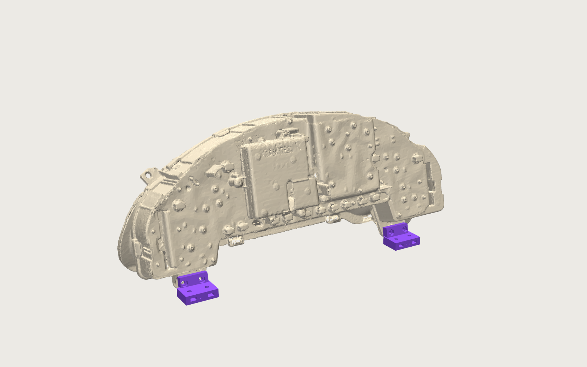
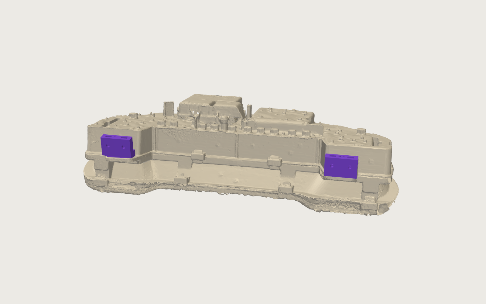

# Build guide: Probe GT gauge cluster enclosure and cage mount

**Status (2026-09-27, v0.5 in progress).** The first Shell L test print showed the "cradle" idea (cluster held by shape and
foam, no fasteners) was the wrong call: the bosses were solid, the lug plates unreachable. The design is now split in two:

- **Chassis: two printed lug feet.** The cluster bolts to them through its own OEM holes (four M4). They are the only
  parts that depend on the scan at the millimetre level, and they print in about an hour each. **These are the next print.**
- **Body: the shell (v0.5)** is a cover that screws to the feet from the outside, through the bottom wall directly above
  the cage knuckles. No cradle features; front and lips 11.5 mm further forward for the clear lens, rear wall 3 mm further
  back, roof slots for the two ear tips, wider ribbon ports, four counterbored screw holes over the feet.
- **Mount (v0.3)** is unchanged in concept: four split clamps on the crossbar and the two steering-support arms, M8
  pivots, M6 locks. Its STLs were regenerated because the shell front moved.
- **Fastener access is now checked by the generator** (`mechanical/fastener_check.py`): every screw and bolt gets a driver
  swept from its head at the assembly stage where it is driven, and must have its reach free. All 34 pass; see section 7 for
  what that means in the car.

## 0. Start here: print the two lug feet and bolt the cluster to them

| Part | File | ASA | Time |
|---|---|---|---|
| Foot lug L | `mechanical/output/print/print_foot_lug_L.stl` | 12 g | ~1 h |
| Foot lug R | `mechanical/output/print/print_foot_lug_R.stl` | 12 g | ~1 h |

Slicer: pad face on the bed (already oriented), no supports, 0.2 mm, 4 walls, 60 percent infill. ASA or PETG both fine.

Hardware for the test: 4 x M4 x 16 (button or socket head), 4 x M4 nuts, 4 x M4 washers of 9 mm OD or less.

1. Press an M4 nut into each hex pocket on the rear face of the slab (the tilted face with two holes).
2. Cluster face down on a towel. Hold Foot L behind the **face-right** lug plate (the plate with round holes only), slab
   against the plate's rear face, pad hanging below the plate's bottom edge. Foot R goes behind the **face-left** plate
   (the one with the slotted hole).
3. Push the M4 bolts with washers from the **front** of the plate (gauge side) through the pair of holes 19.7 mm apart and
   into the nuts. Snug, do not crush the old plastic.
4. Stand the cluster on its two feet on a flat table, gauge face vertical. Check:

| Check | Pass |
|---|---|
| Bolts | pass freely through plate and foot (foot holes are 4.5 mm); nuts do not spin in their pockets |
| Slab on plate | slab lies flat on the plate's rear face; any gap under 0.5 mm (0.8 mm designed standoff) |
| Outer edge | slab's outboard edge clears the rib along the plate's outer edge |
| Pad | nothing but the plate touches the foot; the housing above and behind the pad stays clear |
| Coplanar | both pads flat on the table at once, cluster does not rock more than 0.5 mm |
| Ribbon | both ribbon plugs still fit and their thumb locks still work with the feet on |

Send the numbers for anything that fails. Knobs in `mechanical/generate.py`: `FOOT_STANDOFF`, `LUG_FOOT_MARGIN_OUT`,
`LUG_PAD_Z`, `BOLT_M4_CLR`, `NUT_M4_AF`. A reprint is an hour.

Then, in order:

1. **Shell L v0.5** (`print_shell_L.stl`, 421 g, 198 mm tall, about 12 h). Rear wall on the bed, brow up, brim on, tree
   supports only under the top lip, the chin and the two knuckles (the roof and side walls are vertical; the vent slots,
   ribbon port, ear slots and air gap need none). Nothing on this half is scan-critical any more: the cluster-with-feet
   should drop in with about 4 mm of daylight all round and the feet's pads should land on the bottom wall over the four
   counterbored holes. Check that, screw two M2.5 through the wall into Foot L, and look at the lens against the lip.
2. **Shell R v0.5** (402 g), then the spine and keel bars (plate C, purple).
3. `print_bar_clamp_lower_driver.stl` (34 g) on the painted crossbar, then plate D.

## 1. Printed parts

### Chassis (scan frame STLs, v0.5)

| Part | File | Qty | Colour | Notes |
|---|---|---|---|---|
| Foot lug L | `mechanical/output/foot_lug_l.stl` | 1 | charcoal ASA | behind the face-right lug plate (scan holes B2 B3); 37 x 31 x 21 mm |
| Foot lug R | `mechanical/output/foot_lug_r.stl` | 1 | charcoal ASA | behind the face-left lug plate (scan holes B5 B6) |

Each foot is an L: a slab parallel to the lug plate (0.8 mm off its rear face, two M4 clearance holes, hex nut pockets at
the back) and a pad that reaches down to the shell's bottom wall with two M2.5 heat-set inserts in its underside. The shell
screws come up from outside the bottom wall into those inserts, in line with the M4 bolts above them.

There are no ear feet. The scan shows the two top ear tabs boxed in: housing top about 1.5 mm below the hole axis directly
behind the tab, cavity roof about 7.6 mm above it with the tab tip touching it, bezel in front. No nut, insert or bolt head
fits there. The v0.5 shell captures each ear tip (measured 19.5 mm wide, 7 thick, standing 10 mm above the housing top) in a 21.5 x 11 mm roof slot with foam instead.

### Body (scan frame STLs, v0.5)

| Part | File | Qty | Colour | Notes |
|---|---|---|---|---|
| Shell L | `mechanical/output/shell_l.stl` | 1 | charcoal ASA | 213 x 229 x 198 mm; ear slot, ribbon port, two counterbored foot-screw holes |
| Shell R | `mechanical/output/shell_r.stl` | 1 | charcoal ASA | not a mirror of L: the cluster is not symmetric |
| Spine bar | `mechanical/output/spine_bar.stl` | 1 | purple ASA | joins the halves along the roof ridge and brow |
| Keel bar | `mechanical/output/keel_bar.stl` | 1 | purple ASA | L-shaped, rear wall and the rear part of the bottom seam; stops at z 12 so the M6 lock nuts stay reachable |
| Test coupon | `mechanical/output/test_coupon.stl` | 1 | any | optional |

### Mount (car frame STLs, `mechanical/output/mount_*.stl`, v0.3)

| Part | Qty | Colour | Notes |
|---|---|---|---|
| Bar clamp lower driver / center | 2 | charcoal ASA | plain split-clamp halves for the 1.75 in crossbar |
| Bar clamp upper driver / center | 2 | charcoal ASA | upper halves with the pivot clevis (M8) growing out of the ring |
| Arm clamp lower driver / center | 2 | charcoal ASA | plain halves for the two 1.75 in steering-support arms |
| Arm clamp upper driver / center | 2 | purple ASA | upper halves with a short strut and slotted lock clevis (M6) |

"driver" = toward the A-pillar bar (car x 107 on the crossbar, the arm at x 203); "center" = toward the passenger
side (crossbar x 417, arm at x 325).

## 2. Hardware

| Item | Qty | Used for |
|---|---|---|
| M4 x 16 button or socket head, M4 nuts, M4 washers (9 mm OD) | 4 each | cluster lug plates to the two feet, through the OEM 5.3 mm holes |
| M2.5 x 4 heat-set inserts, 3.5 mm OD | 4 + 14 | 4 in the feet (shell screws), 6 under the spine bar, 8 under the keel bar |
| M2.5 x 8 socket or button head screws | 22 | 4 shell-to-feet, 14 into bar inserts, 4 through the brow with nuts |
| M2.5 nuts + small washers | 4 | the two screw pairs on the brow (2 mm skin, no rib for an insert) |
| M8 x 50 bolts, nyloc nuts, nylon washers | 2 | pivot pins through the bar-clamp clevises and the shell's pivot knuckles |
| M6 x 40 bolts, nyloc nuts, washers | 2 | pitch locks through the arm-clamp slotted clevises and the shell's lock knuckles |
| M6 x 60 bolts + nuts | 8 | the four split clamps (2 each) |
| Adhesive foam tape, 3 mm EPDM | ~200 mm | ear slots and the front lip / chin of the v0.5 shell |

## 3. Print

Material: ASA. 0.2 mm layers, 4 walls; 60 percent infill for feet and clamps, 30 percent gyroid for the shells,
100 percent for bars and coupon.

1. **Feet first** (section 0): pad face down, no supports.
2. **Clamp-fit sample.** One *Bar clamp lower* half on the painted crossbar; the bore is 44.85 mm (`CLAMP_BORE` in
   `mechanical/mount.py`). Adjust and reprint before the other seven halves.
3. **Shells**: rear face down, brow up, brim on, supports only under the top lip, chin and the four knuckles. About 12
   hours each. Heat-set the spine and keel inserts as before (6 from the roof skin at x +-6, z -40 / 0 /
   +40; 4 in the rear wall pads at x +-12, y 58 and 84; 4 in the bottom wall pads at x +-12, z -30 and +20).
4. **Spine bar**: inner (concave) face down, small support under the curled brow end. **Keel bar**: rear leg flat.
5. **Clamp halves**: split face down; clevis and strut grow upward with no supports.
6. Heat-set the four M2.5 inserts into the underside of the two feet (6.5 mm deep bores).

## 4. How the mount connects to the enclosure

The shell's bottom wall carries four knuckles, all moulded into the shell halves:

- **Two pivot knuckles** (24 mm wide, 40 mm long, M8 bore across the car) directly under the two feet, at scan x +-155.
  They land directly above the crossbar. Each drops into the clevis on a *Bar clamp upper*; an M8 bolt through clevis and
  knuckle is the pitch axis.
- **Two lock knuckles** (16 mm wide, M6 bore) near the front-bottom edge, at scan x +59 and -62.5, directly above the two
  steering-support arms. Each drops into the slotted clevis on an *Arm clamp upper*; an M6 bolt through the slot and
  knuckle locks the pitch. The 16 mm slot gives about +-5 degrees of trim around the modelled 20 degrees.

Load path: cluster -> M4 bolts -> feet -> M2.5 screws through the bottom wall -> knuckles (about 15 mm away) ->
clevises -> clamps -> crossbar and both arms. Nothing hangs off the A-pillar bar and nothing is glued.

## 5. Assembly

Chassis, on the bench (section 0 steps 1 to 3): nuts in the pockets, feet behind the lug plates, four M4 from the front.
Heat-set the M2.5 inserts into the feet before this.

Body (v0.5, when it exists):

1. Foam in the ear slots and on the rear faces of the lip and chin.
2. Lay Shell L on its outer side. Lower the cluster with its feet in from the split plane: each pad lands on the bottom
   wall over its knuckle, the ear tips enter the roof slots, the bezel tucks behind lip and chin.
3. Shell R over the cluster until the halves meet at the centre seam. Spine bar (six M2.5 into inserts, four brow screws
   with nuts), keel bar (eight M2.5).
4. Four M2.5 x 8 from underneath through the bottom wall into the feet. These are the only screws that hold the cluster to
   the shell and they are all reachable with the shell closed.
5. Plug the two ribbon cables into the PCB slots through the rear-corner ports; thumb locks face outboard.

Mount:

6. Fit the two bar clamps loosely at 107 and 417 mm from the driver-upright junction along the crossbar, clevises up,
   M6 x 60 through the fore-and-aft flanges.
7. Fit the two arm clamps loosely on the steering-support arms, centred 55 mm from the crossbar axis toward the driver
   (the clean straight tube is between 35 and 80 mm), struts up and leaning back toward the crossbar.
8. Lower the closed enclosure so the two pivot knuckles drop into the bar-clamp clevises; M8 bolts with nylon washers,
   nyloc nuts loose. Swing the lock knuckles into the arm-clamp clevises, M6 bolts through the slots.
9. Sit in the car. Slide the clamps along their tubes until the knuckles sit centred in the clevises, set the pitch so the
   gauge face looks straight at you, then tighten: M8 pivots, M6 locks, arm clamps, bar clamps.
10. Check the ribbon plugs can still be pulled and reseated with everything tight.

To remove the cluster later: two M8, two M6, lift the enclosure off; four M2.5 from underneath; keel bar, spine bar,
halves apart; the cluster comes out with its feet still bolted on.

## 6. What the Shell L test print measured (2026-09-27)

These numbers drive v0.5; they are also in the constants of `mechanical/generate.py`.

- OEM mounting holes: all eight are 5.3 mm; B6 (face-left lower outer) is a 5.3 x 8.8 slot. The scan had 5.3 to 6.8.
- Lug hole pair spacing 19.7 mm (scan 20.2). Lug plates 4.8 mm thick, ear tabs 7.0 mm. Free space behind the lug plates
  38 mm, behind the ears 50 mm, both to the plane the ribbon connectors sit on.
- The CSV hole centres lie on the tabs' **rear** faces (the holes were fitted on the rear scan): the cluster seated with
  the plates flat on stop pads designed 1 mm off those faces.
- The rear of the cluster touched the rear grate designed 2.2 mm clear: the cluster is 2 to 3 mm deeper than the scan.
  v0.5 moves the rear wall back 3 mm.
- The clear lens stands about 10 mm proud of the scanned rim (the scanner did not see the transparent lens). v0.5 moves
  the shell front and lips forward 10 mm, and the lips overlap only the black bezel frame.
- Ribbon plugs: face-right 51 x 9.6 mm, face-left 59.8 x 9.6 mm, thumb lock adds 4 mm outboard. The v0.5 ports grow to
  fit the 60 mm plug with the lock open.
- Each lug plate has a rib along its outer edge 6 to 7 mm outboard of the outer hole, hence the feet's short outboard margin.
- Ear tabs: 19.5 mm wide, 7 mm thick, tip 10 mm above the housing top, hole about 5 mm below the tip.

## 7. Fastener access (what the check says about working on the car)

`python mechanical/fastener_check.py` sweeps an 8 mm driver from every head along its axis, against the parts present at
the stage where that fastener is driven (feet on the bench; closing the shell on the bench; pins on the car), and also
reports the free length with everything fitted. All 34 fasteners have their reach (60 mm for a screwdriver, 30 mm for a
socket). What it means in practice:

- The four M4 cluster bolts and the four M2.5 shell-to-feet screws are **bench operations**. In the car the shell's chin
  sits 27 to 41 mm in front of the M4 heads and the bar clamps sit 30 mm under two of the M2.5 heads. To take the cluster
  out: two M8, two M6, lift the enclosure off, then everything is open.
- Keel rear screws face the dash, 25 to 43 mm away; keel bottom screws have 34 mm to the crossbar. Both are fitted on the
  bench and reachable in the car with a stubby driver.
- M8 pivots: on the driver-side clamp put the **nut on the outboard side** (49 mm to the dash) and the head inboard.
- M6 locks: **heads outboard, nuts inboard**. The keel bar's bottom leg was shortened to z 12 so the inboard nuts have
  room; before that they had 19 mm.

## 8. Regenerating

Everything is generated from constants: `mechanical/generate.py` (feet and shell, scan frame) and `mechanical/mount.py`
(placement and mount, car frame). `python mechanical/generate.py` rebuilds the STLs and checks every scan-facing part
against the scan mesh (the feet report zero penetrations and 0.35 mm minimum distance); `python mechanical/mount.py`
rebuilds the mount and reports sightline, visibility and clearance checks; `print_prep.py` writes the bed-oriented
`output/print/*.stl` and `print_plan.md`; `fastener_check.py` sweeps a driver from every fastener head (section 7); `render.py` / `render_system.py` remake the
renders; `push.py` uploads both
FeatureScript features to Onshape and rebuilds both assemblies there (about 30 Onshape API requests, so push only when you
want to look; the feature gained a `buildFeet` toggle that push.py must pass on the next push).

Placement knobs in `mount.py`: `FACE_Y` (gauge face behind the crossbar, -38), `EDGE_LIFT` (front-bottom edge above the bar
top, 50), `PITCH` (face lean-back, 20), `X_C` (lateral centre, 262 = on the steering column), `ARM_CLAMP_Y` (-55).

