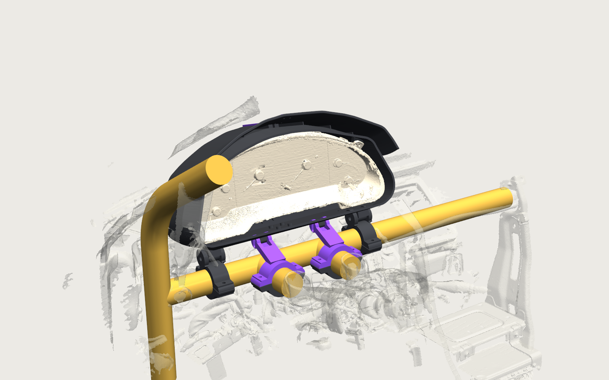

# Build guide: Probe GT gauge cluster enclosure and cage mount

Printed parts, hardware, print settings and assembly order for enclosure v0.4 and mount v0.3. The gauge cluster itself
is never drilled or screwed: it sits in a cradle inside the two shell halves, and the closed shell bolts to the cage through
four knuckles moulded into its bottom wall.

## 0. Start here

Print-ready files live in `mechanical/output/print/` (every part already lies with its bed face on z = 0; drop them straight
into Bambu Studio, no re-orienting). The plate plan with footprints, heights and ASA grams is
[`mechanical/output/print/print_plan.md`](../mechanical/output/print/print_plan.md). Order:

The M2.5 sizes (3.4 mm insert bore, 2.4 mm self-tap pilot) are carried over from the race-logger coupon printed in ASA on
2026-09-12, so they need no re-test. New and unverified here: the 44.85 mm clamp bore, the 8.4 mm M8 pin hole and the M6 nut
pocket. Order:

1. `print_bar_clamp_lower_driver.stl` (34 g, ~1.5 h): the fit sample. Try it on the painted crossbar: light drag, no rock.
   Adjust `CLAMP_BORE` in `mechanical/mount.py` if not, regenerate (`mount.py`, then `print_prep.py`). Its two flange
   holes also check the 6.4 mm M6 clearance.
2. `print_bar_clamp_upper_driver.stl` (65 g, ~3 h): checks the clevis gap (24.6 mm) against a printed knuckle later, and the
   8.4 mm M8 pin hole now. Bolt it to the lower half on the bar.
3. Plate D, the remaining six clamp halves. Arm-clamp uppers in purple if you have it.
4. Plate C, spine bar + keel bar (purple). The coupon is optional (M6 nut pocket + fin slot only).
5. Shell L, then Shell R (~430 g and 12 to 16 h each, alone on the plate, diagonal if the slicer asks). Before Shell R,
   check a pivot knuckle on Shell L drops into the printed clevis with the M8 bolt through.

Slicer settings: ASA, 0.2 mm layers, 4 walls, 30 percent gyroid in the shells, 60 percent in the clamps, 100 percent in
the bars. Enable supports only where section 3 says. Brim on the shells (tall thin walls, ASA warps). Enclosure door closed.

## 1. Printed parts

### Enclosure (scan frame STLs)

| Part | File | Qty | Colour | Notes |
|---|---|---|---|---|
| Shell L | `mechanical/output/shell_l.stl` | 1 | charcoal ASA | 213 x 229 x 184 mm, fits the Bambu P1S diagonally |
| Shell R | `mechanical/output/shell_r.stl` | 1 | charcoal ASA | not a mirror of L: the cluster is not symmetric |
| Spine bar | `mechanical/output/spine_bar.stl` | 1 | purple ASA | joins the halves along the roof ridge and brow |
| Keel bar | `mechanical/output/keel_bar.stl` | 1 | purple ASA | L-shaped, joins the halves across the rear wall and bottom |
| Test coupon | `mechanical/output/test_coupon.stl` | 1 | any | print first, see section 3 |

### Mount (car frame STLs, `mechanical/output/mount_*.stl`)

| Part | Qty | Colour | Notes |
|---|---|---|---|
| Bar clamp lower driver / center | 2 | charcoal ASA | plain split-clamp halves for the 1.75 in crossbar |
| Bar clamp upper driver / center | 2 | charcoal ASA | upper halves with the pivot clevis (M8) growing out of the ring |
| Arm clamp lower driver / center | 2 | charcoal ASA | plain halves for the two 1.75 in steering-support arms |
| Arm clamp upper driver / center | 2 | purple ASA | upper halves with a short strut and slotted lock clevis (M6) |

"driver" = toward the A-pillar bar (car x 107 on the crossbar, the arm at x 203); "center" = toward the passenger
side (crossbar x 417, arm at x 325).

## 2. Hardware

| Item | Qty | Used for |
|---|---|---|
| M2.5 x 4 heat-set inserts, 3.5 mm OD | 14 | 6 under the spine bar (thick roof ribs), 8 under the keel bar |
| M2.5 x 8 socket or button head screws | 18 | 14 into inserts, 4 through the brow with nuts |
| M2.5 nuts + small washers | 4 | the two screw pairs on the brow (2 mm skin, no rib for an insert) |
| M8 x 50 bolts, nyloc nuts, nylon washers | 2 | pivot pins through the bar-clamp clevises and the enclosure's pivot knuckles |
| M6 x 40 bolts, nyloc nuts, washers | 2 | pitch locks through the arm-clamp slotted clevises and the enclosure's lock knuckles |
| M6 x 60 bolts + nuts | 8 | the four split clamps (2 each) |
| Adhesive foam tape, 3 mm EPDM | ~300 mm | rear faces of the top lip and chin, the six stop pads |

## 3. Print

Material: ASA. 0.2 mm layers, 4 walls; 30 percent gyroid infill for the shells, 60 percent for clamps, 100 percent for bars
and coupon.

1. **Clamp-fit sample first.** Print one *Bar clamp lower* half and try it on the painted crossbar; the bore is 44.85 mm
   (`CLAMP_BORE` in `mechanical/mount.py`). Adjust and reprint before the other seven halves.
2. **Coupon (optional).** The M2.5 insert bore and pilot are the coupon-verified values from the race logger (2026-09-12);
   the coupon here only adds the M6 nut pocket and a cradle-fin slot.
3. **Shells**: rear face down (the flat rear wall is the bed face, the brow points up). Supports only under the top lip,
   the chin, the small ear-pad webs and the four knuckles; everything else is vertical walls. Each half is a 12 to 16 hour print.
4. **Spine bar**: inner (concave) face down, small support under the curled brow end. **Keel bar**: rear leg flat, bottom leg standing.
5. **Clamp halves**: split face down (the flat face that meets the other half is the bed face). The clevis and strut on
   the upper halves then grow upward with no supports.
6. Heat-set the 14 inserts: 6 from the roof skin surface at x +-6 mm, z -40 / 0 / +40 (they land in the 8 mm ribs inside
   the air gap), 4 in the rear wall pads at x +-12, y 58 and 84, 4 in the bottom wall pads at x +-12, z -30 and +20.
   Bores are 6.5 mm deep; the insert sits flush.

## 4. How the mount connects to the enclosure

The enclosure's bottom wall carries four knuckles, all moulded into the shell halves:

- **Two pivot knuckles** (24 mm wide, 40 mm long, M8 bore across the car) under the two lug cradle blocks, at scan x +-155.
  They land directly above the crossbar. Each drops into the clevis on a *Bar clamp upper*; an M8 bolt through clevis and
  knuckle is the pitch axis.
- **Two lock knuckles** (16 mm wide, M6 bore) near the front-bottom edge, at scan x +59 and -62.5, which is directly above
  the two steering-support arms. Each drops into the slotted clevis on an *Arm clamp upper*; an M6 bolt through the slot
  and knuckle locks the pitch. The 16 mm slot gives about +-5 degrees of trim around the modelled 20 degrees.

So the load path is: cluster -> cradle -> shell -> four knuckles -> four clevises -> four clamps -> crossbar and both arms.
Nothing hangs off the A-pillar bar and nothing is glued.

## 5. Assembly

Enclosure:

1. Stick foam tape on the rear face of the top lip and chin in both halves, and a 20 x 20 mm pad on each of the six stop
   pads (two behind each lug plate, one behind each ear).
2. Lay Shell L on its side, outer face down. Lower the cluster in from the split plane: the left lug plate lands on its
   ledge with the fin outside it, the left ear rests on its pad, the bezel rim tucks behind the lip and chin.
3. Bring Shell R over the cluster the same way until the halves meet at the centre seam.
4. Fit the spine bar over the ridge, six M2.5 x 8 into the inserts, then the four brow screws with nuts and washers underneath.
5. Fit the keel bar over the rear and bottom seam, eight M2.5 x 8.
6. Plug the two ribbon cables into the PCB slots through the rear-corner ports; thumb locks face outboard.

Mount:

7. Fit the two bar clamps loosely at 107 and 417 mm from the driver-upright junction along the crossbar, clevises up,
   M6 x 60 through the fore-and-aft flanges.
8. Fit the two arm clamps loosely on the steering-support arms, centred 55 mm from the crossbar axis toward the driver
   (the clean straight tube is between 35 and 80 mm), struts up and leaning back toward the crossbar.
9. Lower the closed enclosure so the two pivot knuckles drop into the bar-clamp clevises; push the M8 bolts through with
   nylon washers, nyloc nuts loose.
10. Swing the lock knuckles into the arm-clamp clevises and fit the M6 bolts through the slots.
11. Sit in the car. Slide the clamps along their tubes until the knuckles sit centred in the clevises, set the pitch so the
    gauge face looks straight at you, then tighten in this order: M8 pivots, M6 locks, arm clamps, bar clamps.
12. Check the ribbon plugs can still be pulled and reseated with everything tight.

To remove the cluster later: two M8, two M6, lift the enclosure off; keel bar off, spine bar off, halves apart.

## 6. Regenerating

Everything is generated from constants: `mechanical/generate.py` (enclosure, scan frame) and `mechanical/mount.py`
(placement and mount, car frame). `python mechanical/generate.py` rebuilds the enclosure STLs and checks the scan mesh for
interference; `python mechanical/mount.py` rebuilds the mount STLs and reports sightline, visibility and clearance checks;
`render.py` / `render_system.py` remake the renders; `push.py` uploads both FeatureScript features to Onshape and rebuilds
both assemblies there (about 30 Onshape API requests, so push only when you want to look).

Placement knobs in `mount.py`: `FACE_Y` (gauge face behind the crossbar, -38), `EDGE_LIFT` (front-bottom edge above the bar
top, 50), `PITCH` (face lean-back, 20), `X_C` (lateral centre, 262 = on the steering column), `ARM_CLAMP_Y` (-55).

